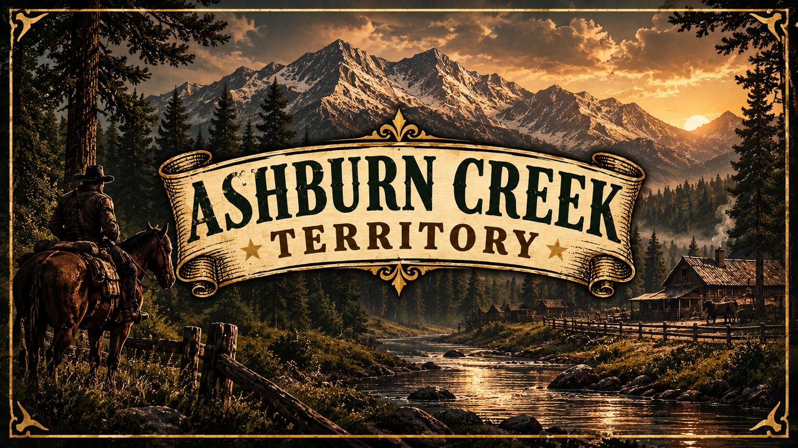

# Welcome to Ashburn Creek

<figure><figcaption></figcaption></figure>

Welcome to Ashburn Creek. Build a grounded frontier story through character-led roleplay.

> A story-driven RedM community built for frontier roleplay, character growth, and memorable scenes.

### What to expect

* **Character-led stories.** Let relationships and consequences shape your direction.
* **Frontier work.** Explore ranching, commerce, medicine, law, and independent livelihoods.
* **Lore-friendly immersion.** Keep your character, speech, and actions appropriate to the setting.

### Start your journey



#### Read the rules

Review the community and server rules before you apply or connect.



#### Prepare your character

Choose an original name. Create a simple backstory with clear goals and limits.



#### Join the world

Start slowly. Meet people, learn the town, and create scenes with others.



### Before you ride

* Use a working microphone and communicate in English.
* Keep out-of-character information out of character decisions.
* Ask staff through a ticket when you need support.

Read [rules](rules/ "mention") first. Then review [keybinds.md](keybinds.md "mention") before connecting.
